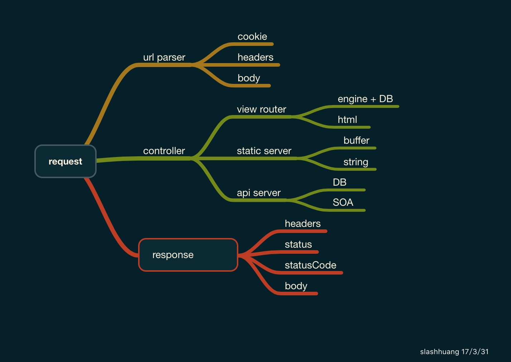

## why choose cuty

> a basic Http server model is framed like below

## Problem with koa or express

in Node.js,we already have famous frameworks like `express` and `koa`. They are all designed with awesome ideas. Take Koa as an example, It provides middleware utility and property delegation for developers, so that all `Koa` users need to do is to shape the middleware work flow and `call next()` to notify the next middleware handler.

of course ,Koa's zen is super simple and easy to understand. But, as a `Koa` developer, I always have to search the `Koa` doc to find `ctx.body ctx.status etc` properties which is not an easy job for newcomers.

Also, koa's middleware workflow using `koa-compose` is a straight-forward uni-direction control flow. middleware shape will always be  flatten but not structured in this way which is actually violative to develpers' thought.

 # Comparison with Other Frameworks

 As Node.js is an async/IO runtime, most of Node.js framework uses stream-like middlewares to

 frame apps.

 For instance `koa` or `express`.

 These frameworks are great ,but also have disadvantages listed below.

 1. stream-like middlewares are flattened without good structure.

 >  when too many middlewares are arranged into the app, the handle flow becomes perplexed.

 >  developers have to maintain each middleware's functionality while worrying about other middleware's logic

2. Developers have to filter the handle logic in each middleware without a Top-level structure.

 > middleware's role-play is flattened which leads to reduntant filter logic in each.

 > take `koa` For instance,`koa-send` and `koa-router` actually stays in parallel position in Node app which means one request can only be flowed into one of them to handle logic.

 > but they are framed in the same middleware queue in `koa`, which leads to perplexed flow logic.

