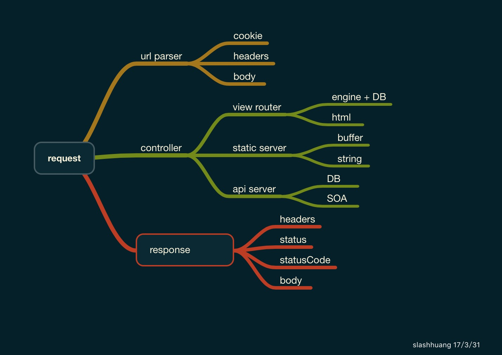

## why choose cuty

> a basic Http server model is framed like below

## Problem with koa or express

in Node.js,we already have famous frameworks like `express` and `koa`. They are all designed with awesome ideas. Take Koa as an example, It provides middleware utility and property delegation for developers, so that all `Koa` users need to do is to shape the middleware work flow and `call next()` to notify the next middleware handler.

of course ,Koa's zen is super simple and easy to understand. But, as a `Koa` developer, I always have to search the `Koa` doc to find `ctx.body ctx.status etc` properties which is not an easy job for newcomers. 

Also, koa's middleware workflow using `koa-compose` is a straight-forward uni-direction control flow. middleware shape will always be  flatten but not structured in this way which is actually violative to develpers' thought.

## what are cuty's advantages

In Cuty's development , I adopted a lot of ideas from koa and express. 
Basically , Cuty combines MVC and middleware to shape Node.js application.

